# Mermaid Diagrams
## AI Math Tutor - System Architecture & Flow

**Last Updated:** November 3, 2025

---

## 1. System Architecture Overview

---

## 2. Data Flow - Complete User Journey

---

## 3. Component Hierarchy

---

## 4. State Management Flow

---

## 5. Conversation Context Management

---

## 6. OpenAI Service Architecture

---

## 7. Cost Optimization Strategy

---

## 8. Conversation Flow - Natural Dialogue

---

## 9. Firebase Data Structure

---

## 10. Step Visualization Logic

```mermaid
flowchart TD
    START[Conversation Starts] --> TRACK[Track Messages]
    
    TRACK --> DETECT{Detect Q&A Pair?}
    
    DETECT -->|AI Question| STEP1[Create Step]
    STEP1 --> WAIT[Wait for Answer]
    WAIT --> ANS[User Answers]
    ANS --> UPDATE[Update Step]
    
    UPDATE --> CHECK{Correct?}
    
    CHECK -->|Yes| COMPLETE[Mark Complete ✓]
    CHECK -->|No| RETRY[Increment Attempts]
    
    RETRY --> HINT{Attempts >= 2?}
    HINT -->|Yes| PROVIDE[Provide Hint]
    HINT -->|No| WAIT
    
    PROVIDE --> WAIT
    
    COMPLETE --> DETECT
    
    DETECT -->|Problem Solved| END[Show Final Steps]
    
    style START fill:#3b82f6,color:#fff
    style COMPLETE fill:#22c55e,color:#fff
    style END fill:#8b5cf6,color:#fff
```

---

## 11. Technology Stack Visualization

---

## 12. Deployment Flow

---

## How to Use These Diagrams

### In Documentation
Copy any diagram into your README.md or other markdown files. GitHub, GitLab, and many markdown viewers support Mermaid natively.

### In VS Code
Install "Markdown Preview Mermaid Support" extension to view these diagrams.

### Online Viewer
Visit https://mermaid.live/ and paste any diagram to view/edit interactively.

### Export as Image
Use mermaid.live to export diagrams as PNG/SVG for presentations.

---

**Document End**